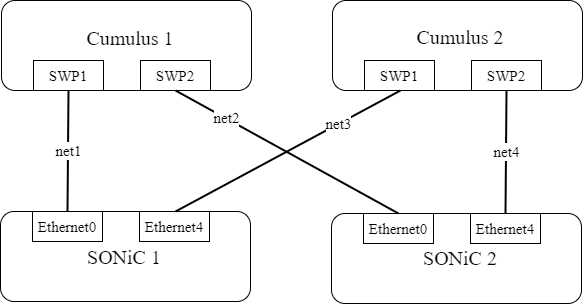
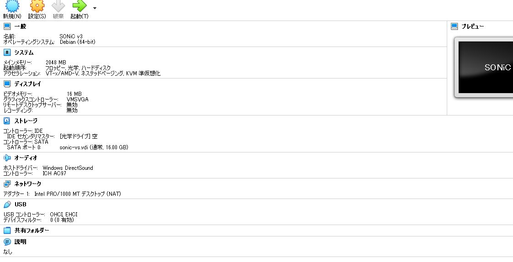

# Cumulus and SONiC




## .img を .vdi にコンバート

[SONiCの開発者が個人で立ち上げたサイト(？)](https://sonic.software/)からsonic-vs.img.gzを取得して，解凍．
その後，`.img`ファイルを`.vdi`に変換．

(※ `.img`ファイルを`.vdi`変換する方法として，VBoxManage.exe でコンバートする方法がよく紹介されていますがうまく起動しませんでした．)

```
> "C:\Program Files\qemu\qemu-img.exe" convert -O vdi sonic-vs.img sonic-vs.vdi
```
vdiファイルでVirtualboxを立ち上げる．

以下，設定例．



バージョン確認
```
$ show version
sudo: unable to resolve host sonic1: Name or service not known

SONiC Software Version: SONiC.master.102109-392899682
Distribution: Debian 11.3
Kernel: 5.10.0-12-2-amd64
Build commit: 392899682
Build date: Mon May 23 19:34:41 UTC 2022
Built by: AzDevOps@sonic-build-workers-001J3P

Platform: x86_64-kvm_x86_64-r0
HwSKU: Force10-S6000
ASIC: vs
ASIC Count: 1
Serial Number: N/A
Model Number: N/A
Hardware Revision: N/A
Uptime: 03:30:40 up 3 min,  1 user,  load average: 0.49, 0.75, 0.36
Date: Sun 29 May 2022 03:30:40

  (省略)
```


## Create Vagrant box

Virtual box guest additionsをインストール．
それぞれのバージョンは，VirtualboxやダウンロードしたSONiCに依存します．
```
sudo apt update -y
sudo apt install -y build-essential dkms wget
wget http://download.virtualbox.org/virtualbox/6.1.34/VBoxGuestAdditions_6.1.34.iso
sudo mkdir /media/VBoxGuestAdditions
sudo mount -o loop,ro VBoxGuestAdditions_6.1.34.iso /media/VBoxGuestAdditions
sudo sh /media/VBoxGuestAdditions/VBoxLinuxAdditions.run
rm VBoxGuestAdditions_6.1.34.iso
```

vagrant box の作成・追加
```
vagrant package --base "<VirtualBoxName>" --output sonic-vs.box
vagrant box add sonic-vs.box --name sonic-vs
```

## 動作確認

### Spine1

```
$ vagrant ssh clos-spine1
==> clos-spine1: The machine you're attempting to SSH into is configured to use
==> clos-spine1: password-based authentication. Vagrant can't script entering the
==> clos-spine1: password for you. If you're prompted for a password, please enter
==> clos-spine1: the same password you have configured in the Vagrantfile.
admin@127.0.0.1's password: 
Linux clos-spine1 5.10.0-12-2-amd64 #1 SMP Debian 5.10.103-1 (2022-03-07) x86_64
You are on
  ____   ___  _   _ _  ____
 / ___| / _ \| \ | (_)/ ___|
 \___ \| | | |  \| | | |
  ___) | |_| | |\  | | |___
 |____/ \___/|_| \_|_|\____|

-- Software for Open Networking in the Cloud --

Unauthorized access and/or use are prohibited.
All access and/or use are subject to monitoring.

Help:    http://azure.github.io/SONiC/

Last login: Tue May 31 08:19:37 2022 from 10.0.2.2
admin@clos-spine1:~$ ip route
default via 10.0.2.2 dev eth0 
10.0.1.1 nhid 100 via inet6 fe80::a00:27ff:fe8f:18b1 dev Ethernet0 proto bgp src 10.1.0.1 metric 20 
10.0.1.2 nhid 104 via inet6 fe80::a00:27ff:fecc:5d9 dev Ethernet4 proto bgp src 10.1.0.1 metric 20 
10.0.2.0/24 dev eth0 proto kernel scope link src 10.0.2.15 
10.1.0.0/24 dev Ethernet0 proto kernel scope link src 10.1.0.1 
10.2.0.0/24 dev Ethernet4 proto kernel scope link src 10.2.0.1 
192.168.1.0/24 nhid 100 via inet6 fe80::a00:27ff:fe8f:18b1 dev Ethernet0 proto bgp src 10.1.0.1 metric 20 
192.168.2.0/24 nhid 104 via inet6 fe80::a00:27ff:fecc:5d9 dev Ethernet4 proto bgp src 10.1.0.1 metric 20 
240.127.1.0/24 dev docker0 proto kernel scope link src 240.127.1.1 linkdown 
admin@clos-spine1:~$ vtysh

Hello, this is FRRouting (version 7.5.1-sonic).
Copyright 1996-2005 Kunihiro Ishiguro, et al.

clos-spine1# show run
Building configuration...

Current configuration:
!
frr version 7.5.1-sonic
frr defaults traditional
hostname clos-spine1
log syslog informational
log facility local4
agentx
no service integrated-vtysh-config
!
password zebra
enable password zebra
!
interface Ethernet0
 ip address 10.1.0.1/24
 ipv6 nd ra-interval 10
 no ipv6 nd suppress-ra
!
interface Ethernet4
 ip address 10.2.0.1/24
 ipv6 nd ra-interval 10
 no ipv6 nd suppress-ra
!
interface lo
 ip address 10.0.0.1/32
!
router bgp 65200
 bgp router-id 10.0.0.1
 no bgp ebgp-requires-policy
 bgp bestpath as-path multipath-relax
 neighbor FABRIC peer-group
 neighbor FABRIC remote-as external
 neighbor FABRIC capability extended-nexthop
 neighbor Ethernet0 interface peer-group FABRIC
 neighbor Ethernet4 interface peer-group FABRIC
 !
 address-family ipv4 unicast
  network 10.0.0.1/32
 exit-address-family
!
ip prefix-list PL_LoopbackV4 seq 5 permit 10.1.0.1/32
!
route-map RM_SET_SRC permit 10
 set src 10.1.0.1
!
ip nht resolve-via-default
!
ip protocol bgp route-map RM_SET_SRC
!
line vty
!
end
clos-spine1# show int b
Interface       Status  VRF             Addresses
---------       ------  ---             ---------
Bridge          up      default         
Ethernet0       up      default         10.1.0.1/24
Ethernet4       up      default         10.2.0.1/24
Ethernet8       up      default         
Ethernet12      up      default         
Ethernet16      up      default         
Ethernet20      up      default         
Ethernet24      up      default         
Ethernet28      up      default         
Ethernet32      up      default         
Ethernet36      up      default         
Ethernet40      up      default         
Ethernet44      up      default         
Ethernet48      up      default         
Ethernet52      up      default         
Ethernet56      up      default         
Ethernet60      up      default         
Ethernet64      up      default         
Ethernet68      up      default         
Ethernet72      up      default         
Ethernet76      up      default         
Ethernet80      up      default         
Ethernet84      up      default         
Ethernet88      up      default         
Ethernet92      up      default         
Ethernet96      up      default         
Ethernet100     up      default         
Ethernet104     up      default         
Ethernet108     up      default         
Ethernet112     up      default         
Ethernet116     up      default         
Ethernet120     up      default         
Ethernet124     up      default         
Loopback0       up      default         10.1.0.1/32
docker0         up      default         + fd00::1/80
dummy           down    default         
eth0            up      default         10.0.2.15/24
eth1            up      default         
eth2            up      default         
lo              up      default         10.0.0.1/32

clos-spine1# show bgp summary 

IPv4 Unicast Summary:
BGP router identifier 10.0.0.1, local AS number 65200 vrf-id 0
BGP table version 13
RIB entries 9, using 1728 bytes of memory
Peers 2, using 43 KiB of memory
Peer groups 1, using 64 bytes of memory

Neighbor        V         AS   MsgRcvd   MsgSent   TblVer  InQ OutQ  Up/Down State/PfxRcd   PfxSnt
Ethernet0       4      65100       152       151        0    0    0 00:06:45            2        5
Ethernet4       4      65101       126       126        0    0    0 00:05:24            2        5

Total number of neighbors 2
clos-spine1# show ip route
Codes: K - kernel route, C - connected, S - static, R - RIP,
       O - OSPF, I - IS-IS, B - BGP, E - EIGRP, N - NHRP,
       T - Table, v - VNC, V - VNC-Direct, A - Babel, D - SHARP,
       F - PBR, f - OpenFabric,
       > - selected route, * - FIB route, q - queued, r - rejected, b - backup

K>* 0.0.0.0/0 [0/0] via 10.0.2.2, eth0, 00:09:31
C>* 10.0.0.1/32 is directly connected, lo, 00:07:56
B>* 10.0.1.1/32 [20/0] via fe80::a00:27ff:fe8f:18b1, Ethernet0, weight 1, 00:06:50
B>* 10.0.1.2/32 [20/0] via fe80::a00:27ff:fecc:5d9, Ethernet4, weight 1, 00:05:28
C>* 10.0.2.0/24 is directly connected, eth0, 00:09:31
C>* 10.1.0.0/24 is directly connected, Ethernet0, 00:07:56
C>* 10.1.0.1/32 is directly connected, Loopback0, 00:09:01
C>* 10.2.0.0/24 is directly connected, Ethernet4, 00:07:56
B>* 192.168.1.0/24 [20/0] via fe80::a00:27ff:fe8f:18b1, Ethernet0, weight 1, 00:06:50
B>* 192.168.2.0/24 [20/0] via fe80::a00:27ff:fecc:5d9, Ethernet4, weight 1, 00:05:28
clos-spine1# 
```


### leaf1

```
$ vagrant ssh clos-leaf1vagrant@127.0.0.1's password: 
vagrant@127.0.0.1's password: 
Linux clos-leaf1 4.19.0-cl-1-amd64 #1 SMP Debian 4.19.237-1+cl5.1.0u1 (2022-05-12) x86_64

Welcome to NVIDIA Cumulus VX (TM)

NVIDIA Cumulus VX (TM) is a community supported virtual appliance designed
for experiencing, testing and prototyping NVIDIA Cumulus' latest technology.
For any questions or technical support, visit our community site at:
https://www.nvidia.com/en-us/support

The registered trademark Linux (R) is used pursuant to a sublicense from LMI,
the exclusive licensee of Linus Torvalds, owner of the mark on a world-wide
basis.
Last login: Tue May 31 08:20:47 2022 from 10.0.2.2
vagrant@clos-leaf1:mgmt:~$ ip route
10.0.0.1 nhid 22 proto bgp metric 20 
10.0.1.2 nhid 22 proto bgp metric 20 
10.1.0.0/24 dev swp1 proto kernel scope link src 10.1.0.2 
192.168.1.0/24 dev swp2 proto kernel scope link src 192.168.1.1 
192.168.2.0/24 nhid 22 proto bgp metric 20 
vagrant@clos-leaf1:mgmt:~$ sudo vtysh

Hello, this is FRRouting (version 7.5+cl5.1.0u0).
Copyright 1996-2005 Kunihiro Ishiguro, et al.

clos-leaf1# show bgp su

IPv4 Unicast Summary:
BGP router identifier 10.0.1.1, local AS number 65100 vrf-id 0
BGP table version 9
RIB entries 9, using 1800 bytes of memory
Peers 2, using 46 KiB of memory
Peer groups 1, using 64 bytes of memory

Neighbor          V         AS   MsgRcvd   MsgSent   TblVer  InQ OutQ  Up/Down State/PfxRcd   PfxSnt
clos-spine1(swp1) 4      65200       201       201        0    0    0 00:09:41            3        5
swp2              4          0         0         0        0    0    0    never         Idle        0

Total number of neighbors 2
clos-leaf1# show ip route
Codes: K - kernel route, C - connected, S - static, R - RIP,
       O - OSPF, I - IS-IS, B - BGP, E - EIGRP, N - NHRP,
       T - Table, v - VNC, V - VNC-Direct, A - Babel, D - SHARP,
       F - PBR, f - OpenFabric, Z - FRR,
       > - selected route, * - FIB route, q - queued, r - rejected, b - backup
       t - trapped, o - offload failure
B>* 10.0.0.1/32 [20/0] via fe80::a00:27ff:fef6:1874, swp1, weight 1, 00:09:53
C>* 10.0.1.1/32 is directly connected, lo, 00:09:57
B>* 10.0.1.2/32 [20/0] via fe80::a00:27ff:fef6:1874, swp1, weight 1, 00:08:31
C>* 10.1.0.0/24 is directly connected, swp1, 00:09:57
C>* 192.168.1.0/24 is directly connected, swp2, 00:09:57
B>* 192.168.2.0/24 [20/0] via fe80::a00:27ff:fef6:1874, swp1, weight 1, 00:08:31
clos-leaf1# 
```

### 疎通確認
```
vagrant@clos-host1:~$ ping 192.168.2.2
PING 192.168.2.2 (192.168.2.2) 56(84) bytes of data.
64 bytes from 192.168.2.2: icmp_seq=1 ttl=61 time=63.8 ms
64 bytes from 192.168.2.2: icmp_seq=2 ttl=61 time=44.8 ms
64 bytes from 192.168.2.2: icmp_seq=3 ttl=61 time=49.8 ms
64 bytes from 192.168.2.2: icmp_seq=4 ttl=61 time=13.5 ms
64 bytes from 192.168.2.2: icmp_seq=5 ttl=61 time=26.7 ms
^C
--- 192.168.2.2 ping statistics ---
5 packets transmitted, 5 received, 0% packet loss, time 4014ms
rtt min/avg/max/mdev = 13.539/39.726/63.798/17.684 ms
```


## 参考
- [SONiCを少しかじってみた](https://debslink.hatenadiary.jp/entry/20210131/1612091391)
- [Vagrant, Creating a Base Box](https://www.vagrantup.com/docs/providers/virtualbox/boxes)
- [VIRTUALBOX から VAGRANT の BOX を作成する](http://vistylee.com/virtualbox-vagrant-box/)
